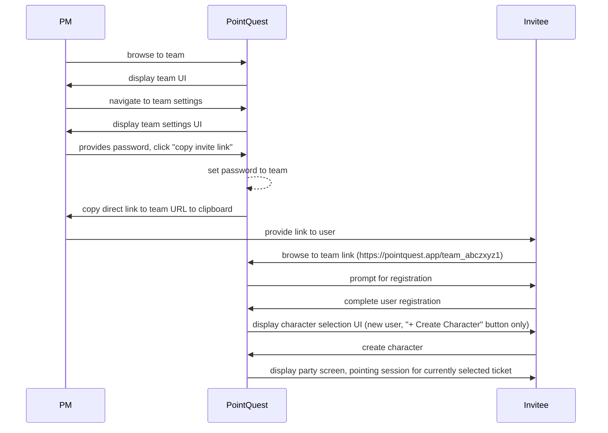

```mermaid
---
Inviting a Member to the Team via link (Invitee == new user)
---
sequenceDiagram

participant PM
participant PointQuest
participant Invitee

PM ->> PointQuest: browse to team
PointQuest ->> PM: display team UI
PM ->> PointQuest: navigate to team settings
PointQuest ->> PM: display team settings UI
PM ->> PointQuest: provides password, click "copy invite link"
PointQuest -->> PointQuest: set password to team
PointQuest ->> PM: copy direct link to team URL to clipboard
PM ->> Invitee: provide link to user
Invitee ->> PointQuest: browse to team link (https://pointquest.app/team_abczxyz1)
PointQuest ->> Invitee: prompt for registration
Invitee ->> PointQuest: complete user registration
PointQuest ->> Invitee: display character selection UI (new user, "+ Create Character" button only)
Invitee ->> PointQuest: create character
PointQuest ->> Invitee: display party screen, pointing session for currently selected ticket
```
